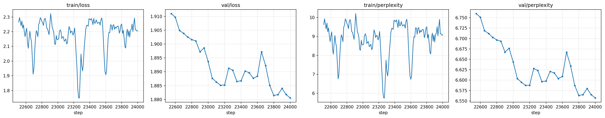

# LLM-Proto

A from-scratch LLaMA-style language model in PyTorch: tokenizer, data pipeline, trainer, inference, chat
and Mixture-of-Experts fine-tuning, with no pre-trained weights and no model library. The same code trains
anything from a **35M** toy on a laptop CPU to a **1.5B** model on a single rented GPU.

## Where it stands

The `large` preset (1.51B parameters) has been pre-trained on FineWeb-Edu + Project Gutenberg to roughly
**8 tokens per parameter (~12B tokens)** on one Google Colab G4 GPU, then fine-tuned on a chat mix.

| | |
|---|---|
| Parameters | 1,508.5M (32 blocks, d_model 2048, 32/8 query/KV heads, 4096 context) |
| Validation loss / perplexity | 1.881 / 6.56 at step 24,000, still falling |
| Throughput | ~14.8k tokens/s, bf16, one ~96 GB Colab G4 |
| Pre-training data | FineWeb-Edu + Project Gutenberg (5.5B Gutenberg tokens in 56 shards) |
| Chat fine-tuning | SmolTalk, UltraChat 200k, Dolly 15k, Alpaca (1.22M conversations, 0.98B tokens) |



It writes fluent English with a noticeable Victorian accent (thank the books) and takes chat turns after
fine-tuning. It is a research and teaching model, not a product: see the transcripts in
[`local-material/transcripts/`](local-material/transcripts/) for the good, the bad and the funny.

## Features

- **LLaMA architecture:** RMSNorm, rotary position embeddings (RoPE), SwiGLU feed-forward, grouped-query
  attention (GQA), tied embeddings; flash attention via PyTorch's `scaled_dot_product_attention`
- **5 presets:** tiny (35M), small (100M), medium (303M), base (466M), large (1.5B), or any custom YAML
- **Tokenizer:** 32K byte-level BPE with byte fallback and ChatML turn markers (`<|im_start|>`, `<|im_end|>`)
- **Data pipeline that tokenizes once:** HuggingFace streaming, `.txt` and `.jsonl` sources into uint16 shards,
  fingerprinted and cached locally or on Google Drive; training never tokenizes
- **Exactly resumable training:** checkpoints carry optimizer, GradScaler, RNG and data-stream position, so an
  interrupted run reproduces an uninterrupted one; OOM steps are replayed with a shorter sequence
- **Mixed precision** (bf16 / fp16 / fp32 chosen from the hardware), gradient accumulation, cosine LR with warm-up,
  optional `torch.compile` and gradient checkpointing
- **Generation and chat:** KV cache, temperature / top-k / top-p, windowed repetition penalty, multi-turn
  `ChatSession` in ChatML, cleanup of hallucinated turns
- **Share it live:** a Gradio chat UI with a temporary public link, one private conversation per visitor
- **MoE fine-tuning:** graft sparse Mixture-of-Experts layers onto a trained checkpoint, train only the experts,
  grow the pool round by round
- **Colab-first notebooks** with Google Drive as persistent storage; also runs on vast.ai or a local GPU
- **Fast CPU test suite** (under 10 s of test time) covering resume, OOM replay, the data cache, MoE and the notebooks

## Quick start

### 1. Install dependencies

```bash
pip install -r requirements.txt
# for tests / linting:
pip install -r requirements-dev.txt
```

### 2. Train the tokenizer

```bash
python scripts/train_tokenizer.py            # uses configs/data.yaml; the output is committed in tokenizer_data/
```

### 3. Build the token shards

```bash
python -m src.data --config configs/data.yaml            # writes data/train_NNNN.bin + data/val.bin + manifest.json
python -m src.data --config configs/data.yaml --max_tokens 100000000   # cap the corpus size
python -m src.data --config configs/data.yaml --force    # re-tokenize even if a valid cache exists
python -m src.data --config configs/data.yaml --gdrive_folder_id LLM   # cache the shards on Google Drive
python -m src.data --config configs/data.yaml --no_gdrive              # ignore the Drive cache for this run
```

`configs/data.yaml` streams FineWeb-Edu (`sample-10BT`) by default. Shards are cached: every run computes a
fingerprint of the tokenizer, the source files and the processing settings; if `data/manifest.json` matches and
every shard has the recorded size, nothing is re-tokenized. With `cache.gdrive_folder_id` set (or
`--gdrive_folder_id`), a local miss falls back to `<folder>/tokenized/<fingerprint>/` on Google Drive, and freshly
built shards are uploaded there. An existing `data/` without a manifest is re-tokenized once.

**Already-tokenized datasets on Drive.** The fingerprint cache only finds data built from the sources in *this*
`data.yaml`; a dataset built from other sources (e.g. the Gutenberg set, or anything from `scripts/local/`) has a
different fingerprint. To use such a dataset as it is, point at its Drive folder (it must hold `train_NNNN.bin`,
`val.bin` and `manifest.json` directly). This never tokenizes; the only check is that the tokenizer matches:

```bash
python -m src.data --prebuilt_folder LLM/gutenberg --output_dir data/gutenberg   # Colab folder path / Drive folder ID
```

In `LLM_proto.ipynb` set `GDRIVE_DATASET_FOLDER = "LLM/gutenberg"`; it is restored into `data/<folder name>/`.

### 4. Train a model

```bash
# Train the tiny model (good for prototyping)
python -m src.train --model tiny --config configs/training.yaml

# Train a larger model with custom settings
python -m src.train --model small --batch_size 16 --peak_lr 3e-4

# Resume from a checkpoint (raises if it does not exist; pass --resume '' to force a fresh start)
python -m src.train --model medium --resume latest

# Skip W&B / Google Drive for a local run
python -m src.train --model tiny --no_wandb --no_gdrive
```

Machine-specific settings (Drive folder, resume target) do not belong in `configs/training.yaml`;
pass them on the CLI or keep a gitignored `configs/local.yaml` and point `--config` at it.

### 5. Generate text and chat

```bash
# Single prompt (architecture and tokenizer are read from the checkpoint)
python -m src.generate --checkpoint checkpoints/best.pt --prompt "Once upon a time"

# Interactive multi-turn chat (no --prompt)
python -m src.generate --checkpoint checkpoints/best.pt --repetition_penalty 1.2
```

**Share it live (optional).** `LLM-inference.ipynb` section 6 wraps the loaded model in a small Gradio chat UI:
set `GRADIO_SHARE = True` and it opens a temporary public link (expires in ~72h or when the Colab runtime stops)
so multiple visitors can each chat with the same model from their own device, with independent conversation state
per visitor.

### 6. Evaluate

```bash
python -m src.evaluate --checkpoint checkpoints/best.pt --data_dir data
```

### 7. MoE fine-tuning (optional)

Turn the FFN of selected blocks into a sparse Mixture-of-Experts layer whose experts start as copies of the dense
FFN, freeze everything else, and fine-tune the experts on domain data with the regular trainer:

```bash
# Round 1: one expert per layer in the last 8 blocks of the large model
python -m src.finetune_moe --base_checkpoint checkpoints/best.pt --expert_layers 24-31 --n_experts 1 --top_k 1 \
    --config configs/finetune_moe.yaml

# Round 2: add one more expert (old experts frozen), activate two per token
python -m src.finetune_moe --base_checkpoint checkpoints/best.pt --expand_from checkpoints/expert/latest.pt \
    --n_new 1 --top_k 2 --config configs/finetune_moe.yaml --checkpoint_dir checkpoints/expert_r2
```

Expert checkpoints carry their MoE shape (`ckpt["moe"]`), so `src.generate` and `src.evaluate` load them unchanged.
`src/corpus.py` builds a fine-tuning corpus from HuggingFace datasets (cleaning chat-template markup, optionally
wrapping question/answer rows in ChatML turns) and tokenizes it through the cached shard pipeline;
`LLM-expert.ipynb` walks through the whole workflow.

## Notebooks (Google Colab)

The notebooks are thin drivers: all logic lives in `src/`, and a test enforces it (no `def`/`class` in a code cell,
every `from src... import` must resolve). On Colab the first cell clones this repository and Google Drive holds
everything that must survive the VM: tokenized shards, checkpoints and outputs.

| Notebook | What it does |
|----------|--------------|
| `LLM_proto.ipynb` | Training. One config cell holds every setting (`MODEL_SIZE`, `N_STEPS` = how many *more* steps, `RESUME_FROM`, Drive folders); then tokenizer → data → train → analyse (loss curves, attention maps, activation and weight stats, 3D embedding plot) → outputs |
| `LLM-inference.ipynb` | Load a checkpoint from Drive, generate, chat in an ipywidgets UI, and optionally share a Gradio link |
| `LLM-expert.ipynb` | Mixture-of-Experts fine-tuning: build a domain corpus, graft experts, train, grow, inspect expert load |

## Tests and smoke run

```bash
pytest -q                      # unit tests, CPU only, < 10 s
ruff check src tests scripts   # lint (config in ruff.toml); must be clean
```

A full CPU pipeline run on a toy corpus (tokenizer → shards → train → resume → generate → evaluate):

```bash
python scripts/train_tokenizer.py --config tests/fixtures/data_smoke.yaml --force
python -m src.data --config tests/fixtures/data_smoke.yaml
python -m src.train --model tests/fixtures/model_smoke.yaml --config tests/fixtures/training_smoke.yaml --max_steps 10
python -m src.train --model tests/fixtures/model_smoke.yaml --config tests/fixtures/training_smoke.yaml --max_steps 20 --resume latest
python -m src.generate --checkpoint smoke_run/checkpoints/latest.pt --prompt "Alice was" --max_tokens 16
python -m src.evaluate --checkpoint smoke_run/checkpoints/latest.pt --data_dir smoke_run/data --batch_size 2
# MoE fine-tuning on top of that checkpoint: graft 2 experts into layer 1, then grow to 3 with top_k=2
python -m src.finetune_moe --base_checkpoint smoke_run/checkpoints/latest.pt --expert_layers 1 --n_experts 2 --top_k 1 --config tests/fixtures/finetune_smoke.yaml --max_steps 5
python -m src.finetune_moe --base_checkpoint smoke_run/checkpoints/latest.pt --expand_from smoke_run/expert/latest.pt --n_new 1 --top_k 2 --config tests/fixtures/finetune_smoke.yaml --checkpoint_dir smoke_run/expert2 --max_steps 5
python -m src.generate --checkpoint smoke_run/expert2/latest.pt --prompt "Alice was" --max_tokens 16
python -m src.evaluate --checkpoint smoke_run/expert2/latest.pt --data_dir smoke_run/data --batch_size 2
```

## Project structure

```
LLM-Proto/
├── configs/                 # YAML configuration files
│   ├── data.yaml            # Data sources & tokenizer settings
│   ├── training.yaml        # Training hyperparameters (model presets live in src/config.py)
│   └── finetune_moe.yaml    # MoE fine-tuning hyperparameters
├── src/                     # Core source code
│   ├── model.py             # Transformer model (RMSNorm, RoPE, GQA, SwiGLU)
│   ├── tokenizer.py         # BPE tokenizer training & inference
│   ├── data.py              # Multi-source data pipeline → binary shards (python -m src.data)
│   ├── train.py             # Full training loop (also drives MoE fine-tuning)
│   ├── moe.py               # SparseMoE layer, grafting, freezing, growth, load diagnostics
│   ├── finetune_moe.py      # MoE fine-tuning CLI (python -m src.finetune_moe)
│   ├── corpus.py            # Fine-tuning corpus: HF datasets → cleaned JSONL → shards
│   ├── generate.py          # Generation, ChatSession, notebook and Gradio chat UIs
│   ├── evaluate.py          # Validation metrics (loss, perplexity)
│   ├── visualize.py         # Model internals visualization
│   ├── config.py            # Configuration dataclasses, presets & validated YAML loading
│   ├── utils.py             # Checkpointing, LR schedule, environment detection
│   ├── gdrive.py            # Google Drive storage (Colab mount or REST API)
│   ├── progress.py          # Byte-level progress bars for Drive transfers
│   ├── outputs.py           # Saving / publishing notebook figures and bundles
│   └── report.py            # Text summaries of a run, a dataset and training results
├── scripts/                 # Automation scripts
│   ├── train_tokenizer.py   # Standalone tokenizer training
│   ├── run_training.sh      # tmux-based training launcher
│   ├── setup_vastai.sh      # vast.ai instance setup
│   └── local/               # Machine-specific helpers, gitignored (e.g. chat-corpus tokenization)
├── tests/                   # pytest suite + smoke-test fixtures
├── data/                    # Tokenized binary data (generated)
│   └── custom/              # Your own txt/ and jsonl/ data
├── tokenizer_data/          # Trained tokenizer output
├── checkpoints/             # Model checkpoints (generated)
├── local-material/          # EPAM.AI Conference 2026 talk: interactive deck, charts, transcripts
├── LLM_proto.ipynb          # Training notebook (Colab-ready)
├── LLM-expert.ipynb         # Mixture-of-Experts fine-tuning notebook
├── LLM-inference.ipynb      # Inference / chat / Gradio notebook
├── DOCUMENTATION.md         # Technical reference (math, diagrams)
└── requirements.txt         # Python dependencies
```

## Model presets

Presets are defined in `MODEL_CONFIGS` in `src/config.py` and selected by name (`--model small`).
For a custom architecture, pass a YAML path instead (`--model my_model.yaml`); it accepts any `ModelConfig` field.
Parameter counts are exact for the default 32K vocabulary with tied embeddings.

| Preset | Params | Dim | Layers | Heads (Q/KV) | Context | Recommended GPU |
|--------|--------|-----|--------|--------------|---------|-----------------|
| `tiny` | 35M | 512 | 6 | 8/4 | 2048 | Any (T4, etc.) |
| `small` | 100M | 768 | 12 | 12/4 | 2048 | T4 16GB |
| `medium` | 303M | 1024 | 24 | 16/4 | 2048 | A10 24GB |
| `base` | 466M | 1280 | 24 | 20/4 | 2048 | A100 40GB |
| `large` | 1.5B | 2048 | 32 | 32/8 | 4096 | 80 GB+ (A100 80GB; trained on a ~96 GB Colab G4) |

## Checkpoints

`save_checkpoint` writes `checkpoints/step_N.pt` plus `latest.pt` and (when validation improved) `best.pt`,
atomically, then optionally uploads to Google Drive. A checkpoint's `step` is the last completed optimizer step;
resuming continues at `step + 1` with the optimizer, GradScaler, RNG states, epoch, and position within the epoch
restored, so an interrupted run reproduces an uninterrupted one. Weights are saved without the `torch.compile`
prefix, so any checkpoint loads in the inference CLIs and in environments where compile is disabled. A training
checkpoint of the 1.5B model (fp32 weights + AdamW state) is roughly 18 GB; the bf16 weights alone are about 3 GB.

## Custom data

Place your data in `data/custom/`:

- **Plain text:** Add `.txt` files to `data/custom/txt/`
- **JSONL:** Add `.jsonl` files (one `{"text": "..."}` per line) to `data/custom/jsonl/`

Then enable the corresponding source in `configs/data.yaml` and rerun `python -m src.data`. Any change
to the files (or to the tokenizer) changes the cache fingerprint, so the shards are rebuilt automatically.

## Training on vast.ai

```bash
# One-time setup
bash scripts/setup_vastai.sh

# Launch training (survives SSH disconnect via tmux)
bash scripts/run_training.sh small
```

## Conference talk

[`local-material/`](local-material/) holds the EPAM.AI Conference 2026 talk *Building an LLM from scratch*:
an offline, interactive HTML deck (3D model of the 1.5B, sampling playground, prompt explorer over real
transcripts, live-demo slides) plus the charts and chat transcripts it was built from.

```bash
python -m http.server 8765 --directory local-material/presentation   # then open http://localhost:8765
```

See [local-material/README.md](local-material/README.md) for controls, the pre-talk checklist and credits.

## Acknowledgements

Inspired by Sebastian Raschka's *Build a Large Language Model (From Scratch)* (Manning, 2024). Trained on
[FineWeb-Edu](https://huggingface.co/datasets/HuggingFaceFW/fineweb-edu),
[Project Gutenberg](https://huggingface.co/datasets/sedthh/gutenberg_english), and, for chat fine-tuning,
[SmolTalk](https://huggingface.co/datasets/HuggingFaceTB/smoltalk),
[UltraChat 200k](https://huggingface.co/datasets/HuggingFaceH4/ultrachat_200k),
[Dolly 15k](https://huggingface.co/datasets/databricks/databricks-dolly-15k) and
[Alpaca (cleaned)](https://huggingface.co/datasets/yahma/alpaca-cleaned). Each dataset keeps its own licence.
The architecture follows LLaMA (Touvron et al., 2023), with RMSNorm (Zhang & Sennrich, 2019),
RoPE (Su et al., 2021), SwiGLU (Shazeer, 2020) and GQA (Ainslie et al., 2023).

## Documentation

See [DOCUMENTATION.md](DOCUMENTATION.md) for a comprehensive technical reference of the entire codebase, including
architecture details, math, and diagrams.

## License

This project is licensed under the MIT License — see [LICENSE](LICENSE) for details. The EPAM conference branding
in `local-material/presentation/` is not covered by it (see [local-material/README.md](local-material/README.md)).
